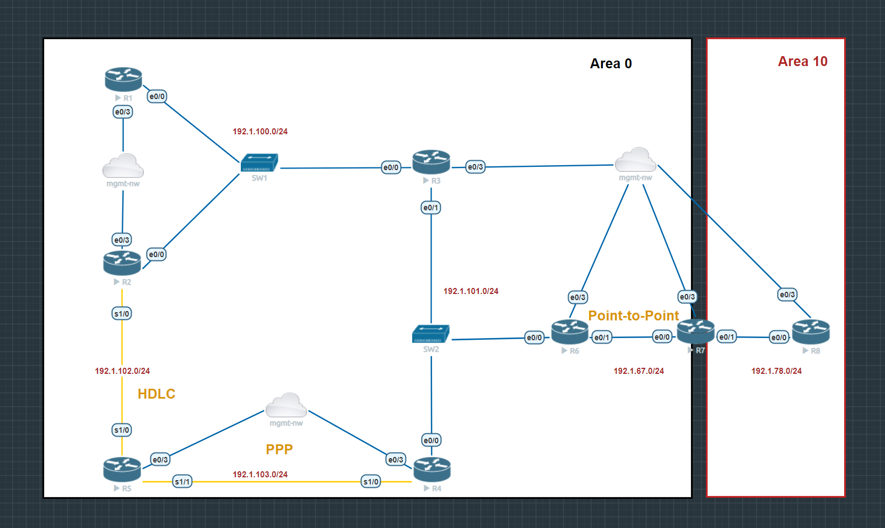
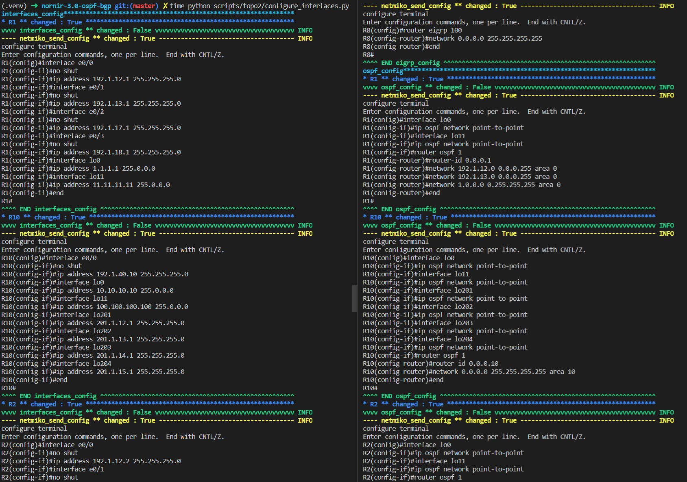

# Nornir-3.0 - Auto OSPF Configuration

## Auto Routing Configuration
This public repo contains python code that can be used to automate different routing configurations of a network. 

The environment is pre-configure for setting the OSPF configuration of my local topologies. You can find the EVE-NG topologies in the zip file `EVE-NG-topologies.zip`.

 You can change the hosts, and networks to be advertised in `inventory/topo/hosts.yaml` to automate your OSPF configuraions.

Where `topo` is the folder that contains the configuration for that topology, including:
- defaults.yaml
- groups.yaml
- hosts.yaml

## Requirements

To use this code you will need:

- Python 3.8+

## Install and Setup
Clone the code to local machine.
```bash
git clone https://github.com/kimdoanh89/nornir-3.0-routing-automation
cd nornir-3.0-routing-automation
```

Setup Python Virtual Environment (requires Python 3.8+)
```bash
python3.8 -m venv venv
source venv/bin/activate
pip3 install -r requirements.txt
```
You can edit the variables in the `inventory/topo/hosts.yaml` to set up your routing configurations.


## Topology 1 - Automating OSPF configuration only



### nw_advertised 
nw_advertised is defined in `hosts.yaml` as a dictionary of OSPF area keys,
and list of networks to be advertised in each OSPF area as values.
Each Router will advertised some networks in a specific area.

```yaml
R6:
    hostname: 192.168.65.136
    groups:
        - area0
    data:
        id: 6
        nw_advertised: {"0": ["192.1.101.0/24", "6.0.0.0/8", "192.1.67.0/24"]}

R7:
    hostname: 192.168.65.137
    groups:
        - area0
        - area10
    data:
        id: 7
        nw_advertised: {"0": ["192.1.67.0/24", "7.0.0.0/8"], "10": ["192.1.78.0/24"]}

R8:
    hostname: 192.168.65.138
    groups:
        - area10
    data:
        id: 8
        nw_advertised: {"10": ["192.1.78.0/24", "8.0.0.0/8"]}
```

For example, conisder the `nw_advertised` of R7
```yaml
nw_advertised: {"0": ["192.1.67.0/24", "7.0.0.0/8"], "10": ["192.1.78.0/24"]}
```
R7 will advertise 2 networks in area 0: `["192.1.67.0/24", "7.0.0.0/8"]`;
and 1 network in area 10: `["192.1.78.0/24"]`


### Run

Run the script with the command:
```bash
time python scripts/topo1/ospf_configure.py
```

### Output

The output is as follows:


## Topology 2 - Automating interfaces configuration, EIGRP, OSPF, RIP configurations


### Variables in hosts.yaml

```yaml
R1:
    hostname: 192.168.65.141
    groups:
        - area0
        - eigrp
        - ospf
    data:
        # interfaces: {name: interface ip address, ...}
        interfaces: {"e0/0": "192.1.12.1/24", "e0/1": "192.1.13.1/24",
                     "e0/2": "192.1.17.1/24", "e0/3": "192.1.18.1/24",
                     "lo0": "1.1.1.1/8", "lo11": "11.11.11.11/8"}
        # eigrp_advertised: { autonomous system: [list of networks to be advertised], ...}
        eigrp_advertised: {"100": ["192.1.17.0/24", "192.1.18.0/24", "11.0.0.0/8"]}
        ospf_router_id: 1
        # ospf_advertised: { area: [list of networks to be advertised], ...}
        ospf_advertised: {"0": ["192.1.12.0/24", "192.1.13.0/24", "1.0.0.0/8"]}
```

### Run

Run the script with the command:
```bash
time python scripts/topo2/configure_interfaces-ospf-eigrp-rip-redistribute.py
```

### Output

The output is as follows:

